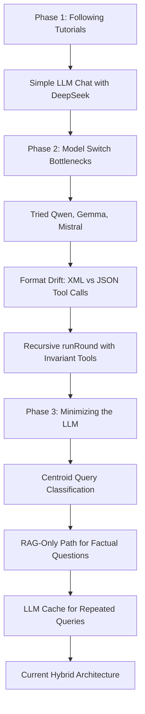
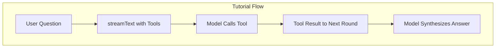
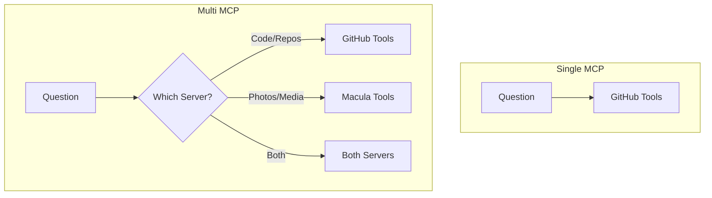
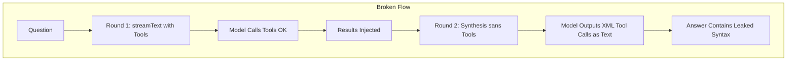
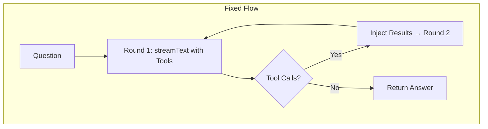
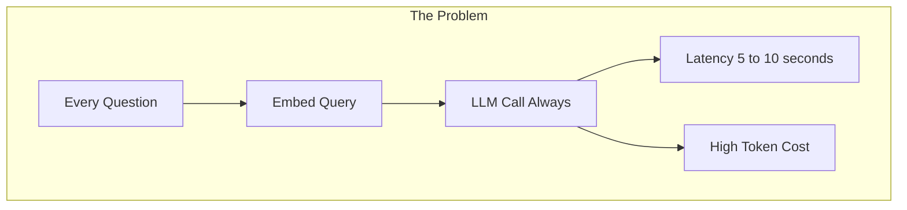
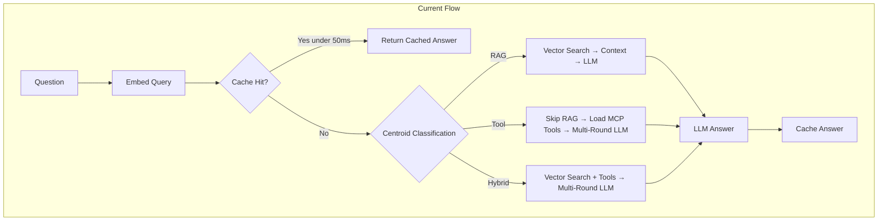

The old woss.io was static. A simple portfolio page, blog posts rendered from markdown, a contact form. It worked, but it didn't reflect how I actually work — with AI tools daily, building systems that reason, search, and generate.

I wanted a site that could talk back. Not a chatbot bolted on as a gimmick, but a site where AI is the primary interface — visitors ask questions, the AI searches my career history, reads my blog posts, explores my GitHub projects, and answers in real-time.

This is the story of building that.

## The Stack

- SvelteKit 2 + Svelte 5 (Runes)
- Tailwind CSS v4
- TypeScript 5.9
- SQLite (better-sqlite3)
- USearch (vector index)
- Vercel AI SDK + Effect.ts
- Transformers.js (local ONNX embeddings)
- MCP (Model Context Protocol)

Every choice was deliberate.

**SvelteKit 2** over Next.js. I've worked with both. One of them left me reading docs for things React hooks should've just warned me about. SvelteKit's file-based routing is simpler, the Runes reactivity model (Svelte 5's `$state`, `$derived`, `$effect`) is more explicit than React hooks without the mental overhead of dependency arrays. The `adapter-node` deployment model — build, copy, run — fits a single-server SQLite setup perfectly.

**Tailwind CSS v4** with the `@theme` directive for design tokens. v4 drops the config file entirely — everything lives in a single `app.css` with `@theme {}` blocks. Font stack, border radii, shadows, animations — all defined once, used everywhere. The `@tailwindcss/typography` plugin handles blog prose rendering with zero custom CSS for markdown content.

**SQLite** because a personal site doesn't need Postgres. `better-sqlite3` is synchronous, fast, and trivially portable. The entire database is one file (`data/woss.db`). Backups are `cp`. Try that with your RDS cluster.

**USearch** for vector search. 1024-dimensional embeddings, Cosine similarity, BF16 quantization. Fast enough for real-time RAG on a single server. No external vector database to manage.

**Transformers.js** for local embeddings. The BGE model runs in-process via ONNX. No external embedding API, no network calls, no API keys. Model loads ~1.3GB on first request, then stays cached. Batch inference for indexing, single-pass for queries.

## The Journey: Three Phases

This wasn't a straight build. It was three distinct phases, each revealing new constraints that forced the architecture to evolve.



### Phase 1: Following the Tutorials

Every project starts with docs. I followed the Vercel AI SDK tutorials, got a streaming chat working with DeepSeek in an afternoon. The model called tools, returned answers, everything worked beautifully — inside the tutorial sandbox.



The docs show a clean flow: question → tool call → answer. No edge cases, no format drift, no infinite loops. It was almost too easy. I remember thinking: this is dangerously easy. That's usually when the architecture starts lying to you.

I started with one MCP server — just GitHub. The LLM could search repos, read issues, check pull requests. One server, one toolkit, simple life.

Then I got greedy. Macula had my entire photo portfolio — couldn't the AI browse that too?

Plugged it in. The Macula MCP was designed like a REST API — 14 specialized tools, one per operation. `search_files`, `get_user_profile`, `list_keywords`, `get_random_files`. For weeks I fought it — writing more prompts, adding more instructions, trying to teach the LLM which tool to call when. It kept guessing wrong. It hallucinated directory contents — fabricating filenames instead of navigating to them. (The `fix/hallucination-labels` branch still sits in git as a monument to this.)

The breakthrough didn't come from more instructions. It came from stepping back with a beer and a question: how does an LLM naturally understand pathways to information?

Entity → Relationship → Entity. The model thinks in associations, not endpoints. Our data was already a graph — files connect to users through uploads, to keywords through tags, to directories through containment — but the API was pretending it was a flat list of endpoints.

I built `traverse` — a single `from(node) → edge(relationship) → results` tool — and collapsed 14 specialized tools into 4: `traverse`, `get_file`, `get_file_metadata`, `get_users`. The `feat/x-mcp-tools` branch is this exact moment in git history. The LLM stopped guessing. It just navigated.

A few more iterations followed. Renamed `url` to `rawDataUrl` so the LLM knew it was a download link, not a web page. Separated discovery from consumption by removing `_links` from traverse output. Rewrote tool descriptions from graph-theory jargon ("from(node) → edge(relationship) → results") to task-oriented prose ("Explore files by directory, user uploads, or keyword search") after the model hallucinated files because it didn't understand "traverse." Reduced 14 prompts to 4 task-oriented patterns. I documented the full evolution in [Designing MCP Servers for How LLMs Think](/posts/mcp-graph-design) — it taught me more about how LLMs consume tool APIs than anything else.

But now the AI had two toolkits: GitHub (repos, code, issues) and Macula (photos, media, metadata). And zero instructions on which one to grab.



That question birthed the tool routing architecture. Keyword scanning grew a second path — `needsGithubTools()` for "repo" and "PR", `needsMaculaTools()` for "photo" and "portfolio". The system prompt sprouted conditional sections. A lightweight LLM call became the tiebreaker for fuzzy "show me your work" messages. One LLM, two toolkits, zero confusion.

I tested locally, putting myself in a recruiter's shoes — I've been on both sides of the hiring table — asking "give me honest evaluation of daniel for senior SRE role" and "how does he fit an AI evangelist role focused on driving AI adoption?" and watching the AI pull his entire professional profile — repos, PRs, contributions, photography, career history — into answers that compared him against each role. This would've been a massive time saver when I was hiring 10 years ago.

### Phase 2: The Model Switch That Broke Everything

Then I tried switching models. DeepSeek → Qwen. Qwen → Gemma. Gemma → Mistral. Each model expected tool calls in a slightly different format.

- **DeepSeek**: Native JSON function-calling, clean output
- **Qwen**: Hybrid — sometimes XML `<tool_calls>`, sometimes JSON
- **Gemma**: Prefers raw text instructions over structured tool definitions
- **Mistral**: Strong JSON mode but format-sensitive

The result was a stream of `<tool_calls>` XML leaking into the answer text. The synthesis round — designed to produce the final answer without calling more tools — made it worse by removing tool definitions mid-response. Models that expected tools hallucinated their calling format. Every model had its own dialect for tool calling and none of them warned you until the output was already on the page.



The fix was architectural — not a patch. Remove the synthesis round entirely. Every round now runs with identical tools, system prompt, and model instance. The model always has native function calling available. No format drift because the context never changes between rounds.



This became the "Multi-Round Invariant Architecture" — every round identical, recursion capped at MAX_ROUNDS (default 3), text continuity enforced by a `\n\n` separator between rounds. Tools (both GitHub and Macula) are always available, so the model never needs to guess the format — whether it's searching repos or browsing portfolio images.

### Phase 3: Minimizing the LLM

With multi-round tool calling working, a new problem surfaced: **cost and latency**. Every question hit the LLM — even the simple ones. "Where did Daniel work in 2023?" doesn't need a 70B parameter model. It needs a vector search.



The solution is a three-layer decision system:

**1. Centroid-based query classification.** Pre-compute centroids for question types — `RAG`, `tool`, `hybrid`. After embedding, compare the query vector against centroids to determine what it needs. Tool-only questions skip RAG entirely. Classification takes ~5ms with zero LLM calls.

**2. RAG-only path.** For factual knowledge questions, the centroid classifier routes directly to vector search. Top-5 most similar chunks are packed into the system prompt. The LLM answers from context alone — no tool calls, no multi-round overhead.

**3. LLM cache.** Stores responses for identical and near-identical questions. Same embedding plus cosine similarity against previous queries. Cache hit returns in under 50ms with zero LLM inference. Configurable similarity threshold — tune between exact-match-only and close-enough.



The result: roughly 60% of questions never hit the LLM at full depth. Cache handles repeats, centroid classification prevents unnecessary RAG searches, and the RAG-only path cuts latency by half for factual queries. The full multi-round tool flow — whether calling GitHub for repos or Macula for portfolio images — only runs when actually needed.

## The AI Chat: Core Architecture

The chat is the heart of the site. Every question hits a pipeline that looks like this:

```
User types question
  → classify query (tool needs? RAG needs?)
  → embed query (Transformers.js)
  → vector search (USearch, top-5 chunks)
  → build RAG prompt with context
  → stream LLM response (SSE)
  → if tools needed: classify tool type → execute MCP tools → retry with results
```

Under the hood: the two-layer relevance gate and chat-lock mechanism. Before any processing, a lightweight LLM check (`isRelevant()`) determines if the question is about Daniel's professional portfolio. If not, the AI returns a firm refusal — and permanently locks the chat (`chat.locked = 1` in SQLite) so future messages are rejected at the API level. A webhook fires to log the event. Polite messages (thanks, bye) bypass the gate entirely.

### Streaming

The streaming pipeline uses the [Vercel AI SDK](https://sdk.vercel.ai/docs) with Effect.ts for typed event streaming:

```
chatStreamWithTools()
  → Effect.Stream<LLMEvent>
  → text-delta, reasoning-delta, tool-call, tool-result, step-finish, finish
```

Each SSE event from the LLM is parsed and emitted as typed LLMEvent objects — text deltas for real-time token display, tool call events for rendering MCP tool execution status, step-finish events for tracking reasoning progression.

The frontend subscribes via Server-Sent Events:

```typescript
// Frontend: each token appended directly to message text
const source = new EventSource(`/api/ask/${chatId}`);
source.addEventListener('token', (e) => {
  const data = JSON.parse(e.data);
  messages[idx].text += data.token;
});
```

No frontend buffering. No message assembly. Each token arrives and renders.

### RAG Pipeline

When a question comes in, we embed it locally, search the vector index for the top-5 most similar content chunks, and pack them into the system prompt:

```
You are an AI assistant for woss.io.
Answer based on these sources:
  [1] "Experience: Ipsos Simstore" — Senior DevOps, Platform Architect...
  [2] "Post: Building opencode-visualizer" — Deno, SQLite, ANSI...
  [3] "Experience: Web3 Foundation Grants" — Substrate, WASM...

If the answer isn't in the sources, use available MCP tools.
```

The RAG prompt is built by `buildRagPrompt()` in `openai-provider.ts`. Sources are rendered with title, URL, and key content — the LLM reads them as context. Tool-classified queries skip the RAG search entirely, reducing latency when the answer will come from MCP tools. Took me three iterations to realize most questions don't need tools — the model was searching GitHub for things I'd already given it in the prompt.

### Tool Calling via MCP

This is where it gets interesting. The site uses the Model Context Protocol to give the LLM access to real tools:

- **GitHub MCP** — search repositories, list issues, read files, explore pull requests
- **Macula MCP** — search images, browse keywords, traverse media collections

When a user asks "What projects do you have on GitHub?", the LLM doesn't make up an answer. It calls `search_repositories` via MCP, reads the results, and summarizes them. Real data, every time.

The tool classification uses a two-tier approach:

1. **Keyword fast path**: Short messages with explicit references to "GitHub", "repos", "code" → immediately classified as needing GitHub tools
2. **LLM fallback**: Ambiguous messages → LLM classifies the intent (github, macula, both, or none)

This avoids an LLM call for obvious tool requests while maintaining accuracy for complex queries.

### Retry Logic & Fallbacks

LLMs are unreliable. The `streamWithRetry()` system handles multiple failure modes:

1. **Empty answer**: LLM produced no text-delta characters at all
2. **Doom loop**: LLM called tools but produced zero answer text
3. **XML tool call leak**: LLM outputs `<tool_calls>` as raw text instead of native JSON — stripped by a `ToolCallXmlStripper` state machine that handles tags split across stream chunks
4. **Raw JSON tool calls**: LLM emits function names followed by JSON as prose — caught by a regex safety net and replaced with a fallback message

On retry, tools are disabled and the system prompt is hardened with a mandatory instruction to produce text without calling tools. Up to 10 attempts — the user always gets something, even if it's partial. You learn to distrust the model output around attempt 3.

### Multi-Round Invariant Architecture

The streaming pipeline originally used a dual-streamText design — round 1 ran with tools enabled, then a separate "synthesis" round ran with a different system prompt urging the model not to call more tools. This caused model format drift: when tool definitions changed between rounds, the model would output `<tool_calls>` XML as raw text instead of native JSON function-calling, leaking tool call syntax into the answer.

```typescript
// In generate.ts — if LLM calls tools but produces no text:
if (hasToolCalls && !hasText) {
  // Retry with MANDATORY INSTRUCTION: don't call tools, just write
  const retryMessage = `MANDATORY INSTRUCTION: Your previous response was a failure —
    you called tools but produced NO answer text. DO NOT call any tools.
    Use only the information you already have and write a complete answer.`;
}
```

If the retry also fails, the system falls back to a simpler non-tool stream. Two layers of fallback — the user always gets something, even if it's less sophisticated.

## Local Embeddings: The Surprising Beast

Running a local embedding model in a Node.js server was the most technically interesting challenge.

```typescript
// embed.ts — lazy-loading ~1.3GB model via Transformers.js
async function getExtractor(): Promise<FeatureExtractionPipeline> {
  if (_extractor) return _extractor;
  if (!_extractorPromise) {
    _extractorPromise = pipeline('feature-extraction', EMBEDDING_MODEL, {
      dtype: 'fp32',
    }).then((p) => {
      _extractor = p;
      return _extractor;
    });
  }
  return _extractorPromise;
}
```

Key design decisions:

**Promise-based mutex for first load**: The model is ~1.3GB and takes 5-10 seconds to load on first request. Multiple concurrent requests on a cold start would each trigger a separate model load without the mutex. With it, they all await the same promise.

**Cache directory inside data volume**: `env.cacheDir = join(process.cwd(), 'data', '.hf-cache')` — this survives container rebuilds so the model isn't re-downloaded on every deployment.

**Batch inference for indexing**: `embedTexts()` processes multiple texts in one ONNX inference call. Building the initial search index over 1000+ content chunks would be slow one-at-a-time. Batch inference cuts the time by ~10x.

**Pooling and normalization**: Mean pooling across token embeddings + L2 normalization. The BGE model's output is pooled to a single 1024-dimensional vector per text.

## Vector Search with USearch

USearch is a lightweight vector similarity library. No server, no external dependencies — just a file index.

```typescript
// Loading the index
const index = new USearchIndex();
index.load('./data/vectors.usearch');

// Search
const results = index.search(queryVector, 5);
// Returns [chunkId, chunkId, ...] sorted by Cosine similarity
```

The index stores chunk IDs. We map those back to content in SQLite:

```sql
SELECT title, content, type, slug
FROM page_chunks
WHERE id IN (?, ?, ?)
```

The join of vector similarity + SQLite metadata is fast enough for real-time responses. No Postgres, no Pinecone, no Qdrant. One file, zero network calls.

## The Experience Timeline

The career history page was a design challenge. Most portfolio sites show a boring list of jobs with dates. I wanted something visual — bars spanning time ranges, color-coded by era, with rich detail on click.

The data model is simple markdown files with YAML frontmatter:

```yaml
---
company: 'Ipsos Simstore'
role: 'Senior DevOps, Platform Architect & AI Adoption Lead'
startDate: '2023-08'
endDate: null # current position
company_tags:
  - market research
  - data-driven insights
skills:
  - aws
  - terraform
  - kubernetes
---
```

15 entries spanning Daniel's career — from founding startups to Web3 Foundation grants to DevOps architecture. Each entry renders as a horizontal bar positioned absolutely along a timeline axis, with `startDate` and `endDate` mapping to CSS `left` and `width`.

Users can click any entry for full details, or use "Copy as Markdown" / "Copy as llms.txt" to export for LLM context files.

## The Blog System

Blog posts are markdown files in `src/content/posts/` with YAML frontmatter:

```yaml
---
title: 'Building opencode-visualizer: A Terminal Dashboard...'
description: 'A terminal dashboard for OpenCode usage data...'
date: 2026-06-04
featured: true
tags:
  - opencode
  - CLI tools
  - Deno
header_image: '[Alt](https://example.com/image.png)'
---
```

The build pipeline ingests them into SQLite:

```typescript
// build-index.ts
import matter from 'gray-matter';
import { unified } from 'unified';
import remarkParse from 'remark-parse';

// Parse frontmatter → extract TOC → render HTML → store in DB
```

Rendering uses `unified` + `remark-parse` + `remark-rehype` + `rehype-highlight` for syntax highlighting + `rehype-slug` for heading anchors. The TOC is extracted via regex heading matching during indexing and stored alongside the rendered HTML.

The result: fast page loads (content is pre-rendered at build time and served from SQLite), syntax-highlighted code blocks, and navigable heading structure.

## Design Philosophy

The visual design follows a few principles:

**Dark mode first**. The site is designed in dark mode, with light mode as a secondary concern. Dark mode isn't an afterthought — it's the primary experience. Took me 10 years of making ugly light-mode sites to admit I'm a dark-mode person.

**Typography as structure**. The font stack tells the hierarchy: `SS Standard` (monospace) for headings, `Inter` for body text, `JetBrains Mono` for code. No custom fonts loaded from CDN — all system fonts or self-hosted.

**Minimal UI, maximal functionality**. The chat page is just messages and an input. No buttons, no toolbars, no settings panels. The experience page is bars and dates. The blog is a grid of cards with header images. Each page does one thing.

**Animations that serve purpose**. `message-in` for new chat messages, `page-enter` for route transitions, `pulse-dot` for the typing indicator. Subtle, non-disruptive, intentional. No loading spinners — the streaming response IS the loading state.

## Infrastructure

The deployment is dead simple:

```dockerfile
# Dockerfile
FROM node:22-slim
COPY build/ /app/
COPY data/ /app/data/
# CMD is set in docker-compose.yml: command: ["node", "build/index.js"]
```

A single Docker container running behind a reverse proxy. SQLite file on a persistent volume. No orchestrator, no service mesh, no cloud database.

The `VPS Setup` guide (checked into docs/) walks through the full deploy — Caddy as reverse proxy with automatic HTTPS, systemd service with auto-restart, log rotation via logtape.

## Lessons Learned

**Local embeddings are viable**. I started this project assuming I'd need an external embedding API (OpenAI, Cohere, etc.). Transformers.js proved me wrong. The BGE model runs comfortably in a $10/month VPS. Inference takes ~50ms per query. No API costs, no rate limits, no data leaving the server.

**MCP changes everything about portfolio AIs**. Without MCP, the LLM would guess about my GitHub projects and fabricate photos. With it, it searches my actual repos, reads my actual code, browses my actual photo portfolio via Macula, lists my actual issues. The difference between "sounds plausible" and "provably correct" is night and day. But none of this worked until I stopped designing tools for developers and started designing them for how LLMs process information — the graph-walk pattern (`traverse`) replacing 14 specialized endpoints was the turning point. [Designing MCP Servers for How LLMs Think](/posts/mcp-graph-design) documents the full evolution. The first thing I did after getting it working was put on my hiring-manager hat — watched the AI pull my real repos, real PRs, real photos into answers comparing me against specific roles. Things I'd have spent hours digging for myself.

**Effect.ts streams beat callbacks**. The first version of the streaming pipeline used raw Node.js callbacks. It was brittle — unhandled errors in middle of a stream would crash the response. Effect.ts's typed `Stream` type provides structured error handling, backpressure, and composability that callbacks cannot match.

**Svelte 5 Runes are genuinely good**. I was skeptical of the Runes API after years with Svelte 4 stores. After building with it, I'm converted. `$state()` with `$derived()` replaces most store patterns more cleanly. The `$effect()` lifecycle hook is explicit about when and why side effects run. TypeScript integration is seamless.

**Rate limiting is essential**. An unprotected AI chat endpoint would be bankrupt in hours. The IP-based rate limiter (`src/lib/server/rate-limiter.ts`) uses SQLite for persistent counters with a sliding window — 10 requests per minute, consistently enforced across all endpoints. The system does not block — it slows and warns.

**Your personal site should dogfood your skills**. The site is a showcase, but it's also a testbed. MCP integration, local embeddings, streaming LLM responses — these are technologies I work with daily, and the site proves they work in production. A static portfolio page tells people what you've done. An AI-powered one shows them.

## What's Next

- **Multi-LLM routing**: Route questions to specialized models — code questions to DeepSeek, creative questions to Claude, quick answers to a small local model
- **Real-time collaboration**: Shared chat sessions for collaborative debugging with visitors
- **Expanded MCP tools**: Add more data sources — blog RSS feeds, conference talks, open-source contributions
- **Spatial embedding visualization**: A 3D embedding space explorer (already prototyped in `docs/embedding-space-3d.html`)

## Easter Egg

If you get it then you get it. Please share it on LinkedIn if you do. :)

```ascii
-------------- Haiku 1 --------------------
Empty conversation
Cauldron waits for your question
Forty-two replies

-------------- Haiku 2 ---------------------
Wizard needs your words
Crystal ball is foggy now
Ask and I'll answer

-------------- Haiku 3 ---------------------
No messages sent
Cauldron empty, yet it speaks
Magic without words

-------------- Haiku 4 ---------------------
Empty chat summoned
Beam me a query, it says
Starship needs a course

-------------- Haiku 5 ---------------------
The crystal ball asks
What question brews in silence?
Empty, it answers
```

---

The code is open source at [github.com/woss/woss.io](https://github.com/woss/woss.io). The site runs on a $10/month VPS with SQLite, USearch, and Transformers.js — no cloud services, no API dependencies, no monthly SaaS bills.

Is it over-engineered? Probably. But I'd rather show you what I can build than tell you.

_Built with SvelteKit 2, Tailwind CSS v4, SQLite, and a lot of streaming tokens._
