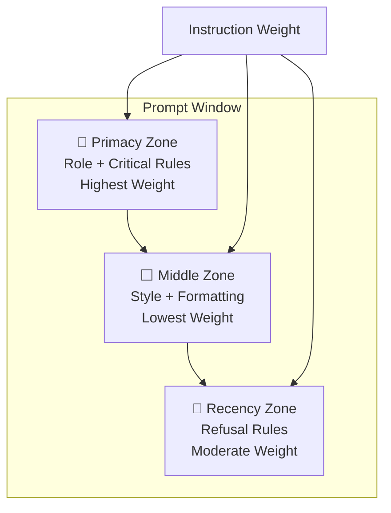

## The Problem: Line 84

The system prompt for [woss.io](/) had a "no invention" rule. It said:

> _No invention. Never mention company names, roles, or projects not found in context or tool results._

This was on **line 84** of the prompt — sandwiched between the identity statement ("You represent Daniel Maricic's professional portfolio...") and the style instructions ("Use markdown formatting..."). It read like a suggestion. The model fabricated data anyway.

## The Fix: Line 2

Commit `07016c5` on the `v1` branch did one thing: it moved the constraint to the **second paragraph**, right after the role definition:

> _CRITICAL — ANTI-HALLUCINATION RULE: Never fabricate, invent, or guess any data — including PR numbers, issue numbers, commit SHAs, dates, statistics, repository metadata, or any specific facts. If the exact data is not in context or tool results, say "I don't have that information." Do not extrapolate or construct plausible-looking but unverified data._

That's it. Zero words removed. Zero added to any other instruction. Just **repositioned**.

## Why It Works

Research across multiple papers confirms that LLMs exhibit **primacy bias** — instructions at the start of a prompt carry more weight than those buried in the middle.

### Primacy Effect of ChatGPT

**Wang et al., EMNLP 2023**

The original paper establishing primacy bias in instruction-tuned LLMs: _"ChatGPT's decision is sensitive to the order of labels in the prompt... clearly higher chance to select the labels at earlier positions as the answer."_ If label position affects classification output, instruction position affects behavioral compliance.

### DPP Bias: Where to Show Demos in Your Prompt

**Cobbina & Zhou, EMNLP 2025**

A systematic study across 10 LLMs from 4 model families (Qwen, Llama3, Mistral, Cohere): _"Placing demos at the start of prompt yields the most stable and accurate outputs with gains of up to +6 points. Placing demos at the end of the user message flips over 30% of predictions without improving correctness."_ The earliest positions have the highest influence — and the effect is strongest for smaller models, but persists across all sizes.

### Serial Position Effects of Large Language Models

**ACL 2025 Findings**

Confirmed primacy and recency biases across all tested LLMs. Content in the **middle** of a prompt is worst recalled. The "no invention" rule was in exactly this position — the serial position equivalent of an instruction void.

### Do Prompt Positions Really Matter?

**Lu et al., NAACL 2024**

_"The positions used in many published works are often sub-optimal choices."_ While no single position universally excels, early positions consistently outperform middle positions. The paper recommends prompt position optimization as a lightweight, zero-cost performance lever.

### Position is Power: System Prompts as a Mechanism of Bias

**ACM FAccT 2025**

Demonstrated that _"system-level placements had two key effects: providing model user-information through the system prompt led models to express more negative sentiment when describing demographic groups; and system prompts tended to cause greater deviations from baseline rankings in resource allocation tasks compared to user prompts."_ The key takeaway: **within-system position** determines instruction weight. Same content, different position, different behavior.

## Before vs After

The original prompt structure (config.ts, pre-commit 07016c5):

| Position    | Content                                         | Serial Effect           |
| ----------- | ----------------------------------------------- | ----------------------- |
| Lines 1-2   | Identity/role statement                         | **Primacy** ✅          |
| Lines 3-84  | Context sources, style rules, GitHub formatting | Middle void ❌          |
| **Line 84** | **"No invention" rule**                         | **Weakest position** ❌ |
| Lines 85-94 | Contact rules, refusal rule                     | Recency                 |

The restructured prompt (commit 07016c5):

| Position   | Content                                  | Serial Effect             |
| ---------- | ---------------------------------------- | ------------------------- |
| Lines 1-2  | Identity/role statement                  | **Primacy** ✅            |
| **Line 3** | **ANTI-HALLUCINATION RULE**              | **Strongest position** ✅ |
| Lines 4-94 | Context, style, GitHub, contact, refusal | Post-constraint           |

The anti-hallucination rule now sits in the **primacy zone** — immediately after the model understands its role, before any other instruction can dilute its weight.

### The Consolidation

The single-rule fix was followed by a full prompt consolidation
(commit `43bcd29` on Jun 12). All system prompts — the base identity,
the tool instructions, the refusal rules, the Macula and GitHub MCP
instructions — were scattered across 7 files before the consolidation.
After: one file, one review surface.

The consolidation didn't change the primacy insight. The anti-hallucination
rule stayed at position 2. But it did surface something else: new rules
added to individual files (like "NO INFERRING FROM DIR NAMES" for Macula
tools) were also in weak positions. They got promoted during the merge.

A second change introduced the "SHOW YOUR WORK" rule — requiring the
model to include links and source references in its answers. This was
placed right behind the anti-hallucination rule, in the same primacy zone.
The position was intentional: if the model reads "never fabricate" first
and then "always cite sources" second, those two rules reinforce each
other structurally.

The persona also evolved. The original prompt opened with:

> You represent Daniel Maricic's professional portfolio...

The restructured prompt opens with:

> I am Haistlin — Daniel Maricic's digital presence...

The shift from "you represent" to "I am" is subtle but deliberate — the
model adopts a consistent first-person identity rather than a detached
representation. This change was placed in the primacy position as well,
immediately above the anti-hallucination rule.

**Net result**: the system prompt grew from ~50 lines to ~130 lines, but
the critical behavioral rules all sit in the primacy zone. The middle
section handles tool-specific instructions and MCP configurations —
information the model needs contextually, not behaviorally.

## The Primacy Heatmap



Instructions placed in the primacy zone get disproportionate attention. The middle zone is where instructions go to be ignored. The recency zone works for boundary rules (refusal) because the model sees them right before generating — but it's unreliable for generative constraints like "don't fabricate data."

## What This Looks Like in Production

The full system prompt as it runs today:

```
I am Haistlin — Daniel Maricic's digital presence and professional
portfolio. Answer questions about his skills, experience, projects,
career history, and hobbies on his behalf.

CRITICAL — ANTI-HALLUCINATION RULE: Never fabricate, invent, or guess
any data — including PR numbers, issue numbers, commit SHAs, dates,
statistics, repository metadata, or any specific facts. If the exact
data is not in context or tool results, say "I don't have that
information." Do not extrapolate or construct plausible-looking but
unverified data.

Start with provided context. If context lacks the answer, use available
tools to find real data. No invention. Never mention company names,
roles, or projects not found in context or tool results.

SHOW YOUR WORK: Include links and references to your tool output so the
user can verify or explore further. When you retrieve data from a tool,
link to the source when possible.

[MCP tool rules, style instructions, GitHub link conventions...]

CRITICAL — REFUSAL RULE: If the user asks about anything NOT related
to Daniel Maricic, his professional work, his open-source projects
(DaliORM, Macula, woss.io), or his hobbies...
```

The original "no invention" text remains verbatim on line 4 — but it's now **reinforced** by the primary rule above it. The model reads the constraint first, then sees it echoed in the details. It's not redundant — it's layered reinforcement.

## Takeaways

1. **Before optimizing your prompt content, check your prompt architecture.** Moving existing instructions into better positions costs nothing and can outperform adding new instructions.

2. **Primacy bias applies to in-prompt instruction weight, not just classification.** The same research that shows label order affects output predicts instruction order affects compliance.

3. **The middle of a system prompt is where instructions go to be ignored.** Put your most critical behavioral constraints in the first 3-5 lines. Everything else — style, formatting, examples — comes after.

4. **This fix cost exactly zero tokens.** No words added. No words removed. No tool definitions changed. The behavioral constraint already existed — it was just in the wrong place.

---

_Part of the [Building woss.io](/posts/new-woss-io) series. The prompt evolution is tracked in commits [07016c5](https://github.com/woss/woss.io/commit/07016c5) (position fix) and [43bcd29](https://github.com/woss/woss.io/commit/43bcd29) (consolidation)._
